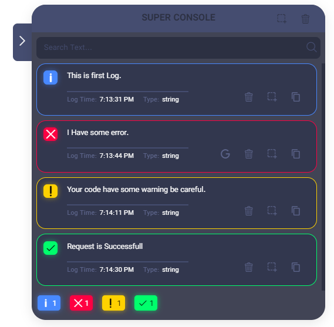

# Vue Super Console

Beautiful floating console for Vue with features such as photos, copies and ...
replace of the browser console.



1. Install the package:
```shell
npm install vue-super-console
```

2. Import component in App.vue or Layout:
```javascript
import VueSuperConsole from 'vue-super-console'
```

3. Put component in template
```html
<vue-super-console></vue-super-console>
```

**WARNING: FIRST CHECK THAT YOU ARE IN DEVELOPMENT MODE THEN RENDER VUE SUPER CONSOLE COMPONENT. ( USE V-IF )**